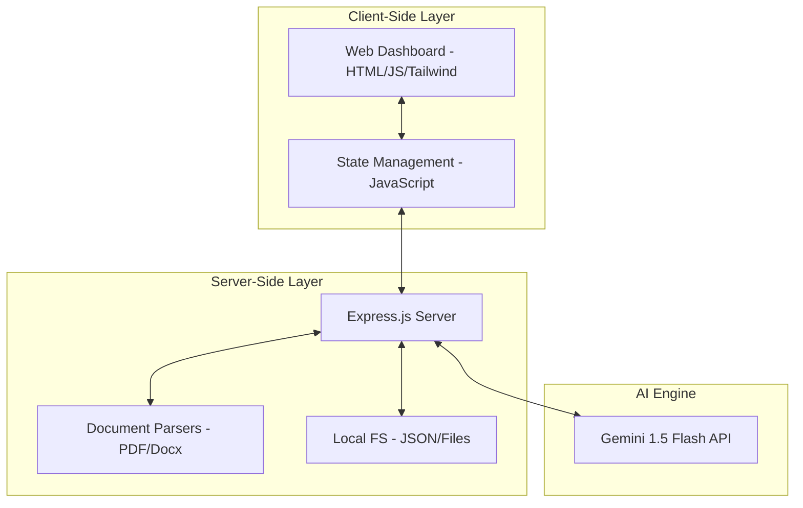
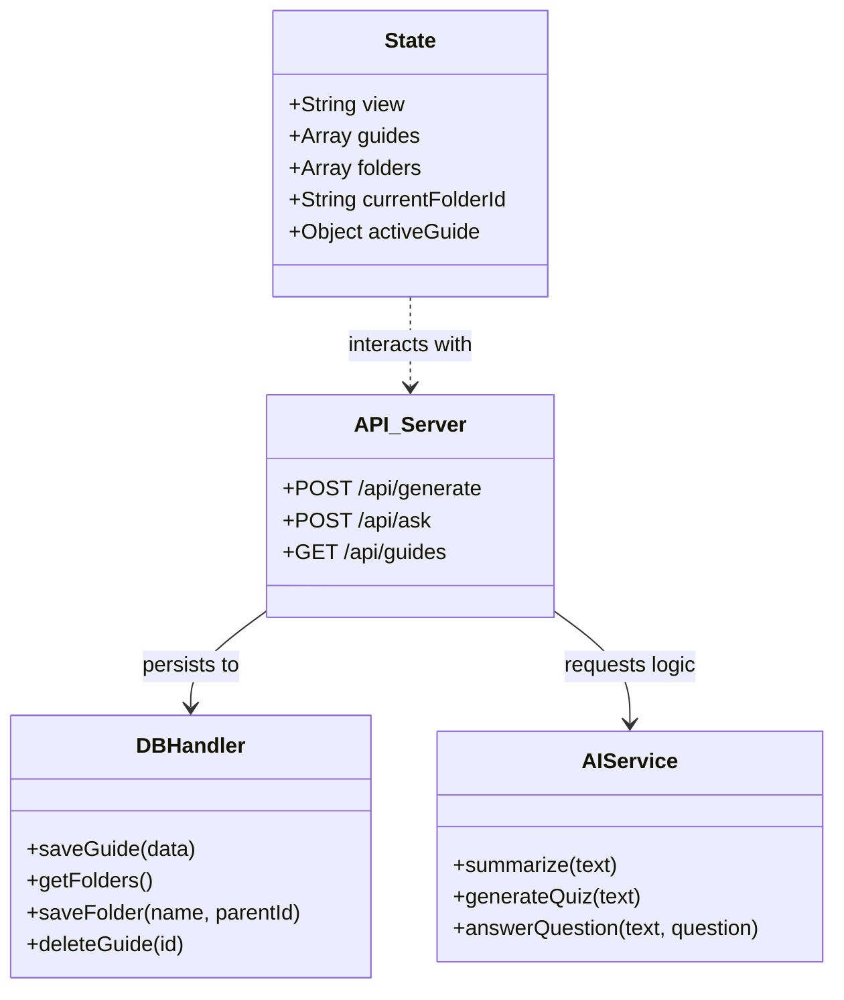
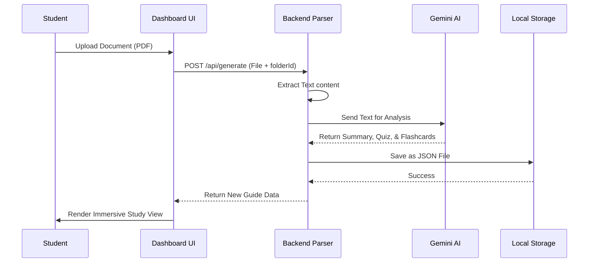

# Chapter 3: System Analysis and Design

## 3.1 Introduction
This chapter outines the technical architecture and design principles used to build Subject Ace. It provides a comprehensive breakdown of the system's structural components, data models, and behavioral logic, ensuring a clear understanding of how the AI-powered study assistant functions from a technical perspective.

## 3.2 System Architecture
Subject Ace follows a **Local-First Client-Server Architecture**. The system is designed to run entirely on a local machine to ensure data privacy and high-speed document processing, while utilizing Google’s Gemini AI API for heavy cognitive tasks.



## 3.3 Technical Stack
The following technologies were selected for the implementation of Subject Ace:

| Component | Technology | Rationale |
| :--- | :--- | :--- |
| **Frontend** | Vanilla JavaScript (ES6+), Tailwind CSS | Ensures a lightweight, high-performance UI with custom animations and zero-framework overhead. |
| **Backend** | Node.js, Express.js | Provides a fast, asynchronous environment for file handling and API orchestration. |
| **AI Engine** | Google Gemini 1.5 Flash | Offers high-context window performance for large academic documents at a low latency. |
| **Persistence** | Local File System (JSON) | Prioritizes "Local-First" data privacy, requiring no external database services. |
| **Parsing** | pdf-parse, mammoth, officeparser | Robust libraries for extracting text from diverse academic formats. |

## 3.4 UML Modeling
### 3.4.1 Use Case Diagram
The Use Case diagram illustrates the primary interactions between the student (Actor) and the Subject Ace system.

```mermaid
useCaseDiagram
    actor Student
    Student --> (Upload Academic Materials)
    Student --> (Organize Nested Folders)
    Student --> (Generate AI Summaries)
    Student --> (Take AI Quizzes)
    Student --> (Study with Flashcards)
    Student --> (Chat with Study Assistant)
```

### 3.4.2 Class Diagram
The Class diagram defines the logical structure of the data and the functional helpers within the system.



### 3.4.3 Sequence Diagram: Document Processing
This diagram details the flow of data when a student uploads a new document.



## 3.5 Database Structure (Entity Relationship)
Subject Ace uses a "NoSQL" approach with local JSON storage, optimized for hierarchical folder structures.

**Entity: Folder**
- `_id`: Unique Identifier (String)
- `name`: Folder Name (String)
- `parentId`: Parent Folder ID (Reference to Folder or 'root')

**Entity: StudyGuide**
- `_id`: Unique Identifier (String)
- `folderId`: Folder ID (Reference)
- `filename`: Original File Name (String)
- `summary`: AI-Generated Text (String)
- `quiz`: Array of Question Objects
- `flashcards`: Array of Recall Pairs
- `createdAt`: ISO Timestamp

## 3.6 Input-Process-Output (IPO) Model
| Component | Description |
| :--- | :--- |
| **Input** | Academic PDFs, Word Documents, Natural Language Questions, Folder Names. |
| **Process** | PDF text extraction, Prompt Engineering, Gemini AI inference, Hierarchical folder sorting. |
| **Output** | 20 Objective Quizzes, Concise Summaries, Interactive Flashcards, Conversational Answers. |

## 3.7 Development Methodology
The project utilized the **Agile Iterative Model**. Development was broken down into "Study Sprints":
1.  **Skeleton Sprint**: Establishing the Local-First storage and basic server.
2.  **AI Sprint**: Integrating Gemini 1.5 and fine-tuning the RAG pipeline.
3.  **UI Sprint**: Building the premium "Immersive" dashboard and folder navigation.
4.  **Refinement Sprint**: Implementing student feedback on navigation and tool focus.

This iterative approach allowed for continuous testing and refinement, ensuring the final system was both technically sound and pedagogically effective.
